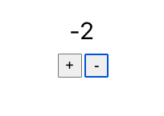

# Counter (Redux)

## Table of contents

- [Overview](#overview)
  - [The challenge](#the-challenge)
  - [Screenshot](#screenshot)
  - [Links](#links)
- [My process](#my-process)
  - [Built with](#built-with)
  - [What I learned](#what-i-learned)
  - [Continued development](#continued-development)
- [Author](#author)

## Overview

### The challenge

Users should be able to:

- View the optimal layout for the app depending on their device's screen size
- Use the increment or decrement button to change the number.

### Screenshot

### Links

- Live Site URL: [View](https://counterredux924.netlify.app/)

## My process

- Import the `createStore()` helper function from the `'redux'` library.
- Create a `store` object that holds the entire state of your Redux application using `createStore()`.
- Get the current state of the `store` using `store.getState()`.
- Dispatch actions to the `store` using `store.dispatch(action)`.
- Create action creators to reduce the repetitive creation of action objects.
- Register a change listener function to respond to changes to the store using `store.subscribe(listener)`.
- Recognize the pattern for connecting Redux to any user interface.

### Built with

- Semantic HTML5 markup
- CSS custom properties
- Mobile-Responsive Design
- JavaScript - Scripting language
- [React](https://reactjs.org/) - JS library

### What I learned

This was a class project to learn core concepts of Redux.

### Continued development

maybe use later

## Author

- Website - [Cameron Howze](https://camkol.github.io/)
- Frontend Mentor - [@camkol](https://www.frontendmentor.io/profile/camkol)
- GitHub- [@camkol](https://github.com/camkol)
- LinkedIn - [@cameron-howze](https://www.linkedin.com/in/cameron-howze-28a646109/)
- E-Mail - [cameronhowze4@outlook.com](mailto:cameronhowze4@outlook.com)
